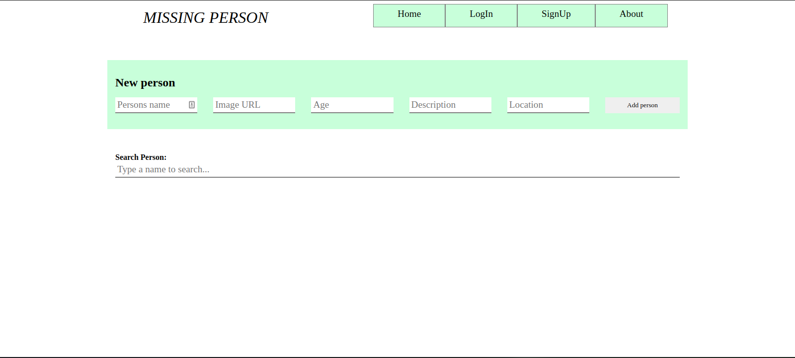
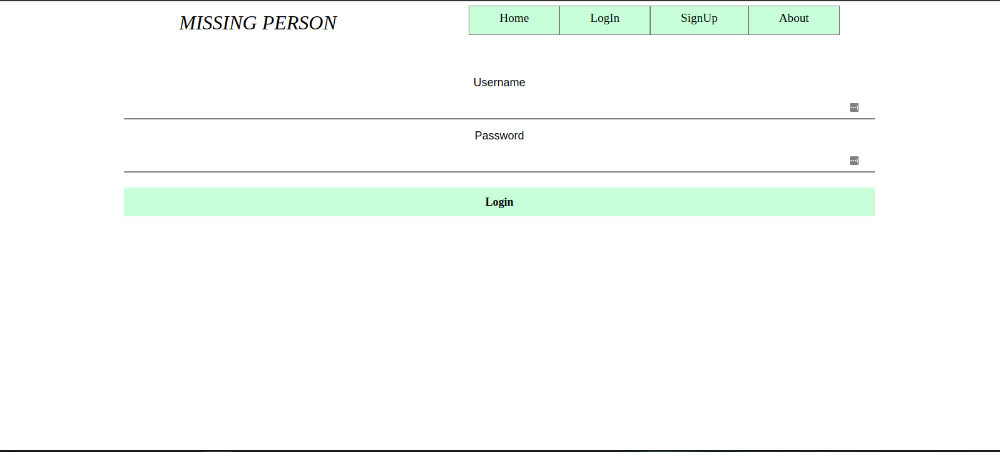
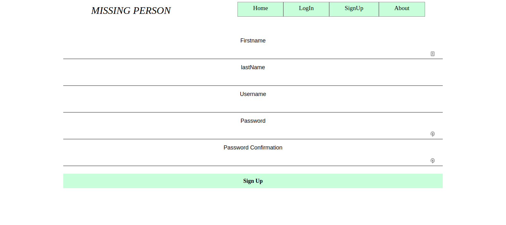
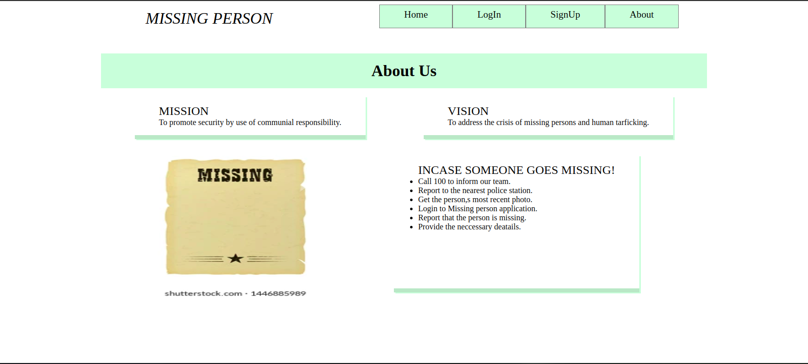

## Missing person React Frontend
## Introduction
This repository contains all the code and documentation for a project on implementing a missing person frontend using React with Rails backend.
## Table of Content
 - [Description](#description)
 - [Features](#features)
 - [Problem statement](##problem)
 - [Installation Process](#installation-Process)
 - [Frontend Link](#Frontend-Link)
  - [Figma Link](#Figma-Link)
 - [Technology  Used](#technology-Used)
 - [Licence](#licence)
 
 
## problem statement
Finding a missing person is a task if shared right online can be a huge win towards finding them. Most often, the available channels are for those with the resources to deploy towards finding their loved ones.  What if you had an application where you could find your missing persons online and also be able to share the word to help you in search of them.
>## Solution
The application where you could find missing persons online and also be able to share a missing person to the world.
You can also allow registered users to comment and bookmark.
# Features
Login
Create an account
Update Profile 
View and search missing persons
Create, Update and Delete new persons
Sign out

# Frontend link 
 (https://github.com/ochienghesbon/missing-_person-client.git)
   
  
 
 

## Installation
For one to use the website, you will have to git clone the repository link into your visual code and run the html file.
This is achieved using:
GIT CLONE: https://github.com/ochienghesbon/missing-_person-client.git

## Available Scripts
In the project directory, you can run:

### `npm start`
Runs the app in the development mode.\
Open [https://github.com/ochienghesbon/missing-_person-client.git](https://github.com/ochienghesbon/missing-_person-client.git) to view it in your browser.
The page will reload when you make changes.\
You may also see any lint errors in the console.

### `npm install `
This install dependencies needed to run the application.

## Technology-Used
* React library and Cascading style sheet were employed during the structuring and styling of the web page
* Javascript language to program the beahaviour of our website.
* Rails server used to store sample data for our website-the server is deployed.

## Author information
Being developed from scratch, this vast project is uptaken by a team of passionate developers, all with various expertise in the various important fields the project is built on.
This team is presented in a tabular view as below.
| NAME                    | POSITION     
|-----                   |  ---- |
| Eric Muthuri       | Frontend Developer |
| Dennis Kosgei      | Backend Developer |
| Ochieng Hesbon     | Backend Developer |
| Cecilia Anyega     | Frontend Developer |
| Murage Gidion      | Frontend Developer |
 
## License
Copyright(c) [2022]
Permission is hereby granted, free of charge, to any person obtaining a copy of this software and associated documentation files , to deal in the Software without restriction, including without limitation the rights to use, copy, modify, merge, publish, distribute, sublicense, and/or sell copies of the Software, and to permit persons to whom the Software is furnished to do so, subject to the following conditions:
The above copyright notice and this permission notice shall be included in all copies or substantial portions of the Software.
THE SOFTWARE IS PROVIDED "AS IS", WITHOUT WARRANTY OF ANY KIND, EXPRESS OR IMPLIED, INCLUDING BUT NOT LIMITED TO THE WARRANTIES OF MERCHANTABILITY, FITNESS FOR A PARTICULAR PURPOSE AND NONINFRINGEMENT. IN NO EVENT SHALL THE AUTHORS OR COPYRIGHT HOLDERS BE LIABLE FOR ANY CLAIM, DAMAGES OR OTHER LIABILITY, WHETHER IN AN ACTION OF CONTRACT, TORT OR OTHERWISE, ARISING FROM, OUT OF OR IN CONNECTION WITH THE SOFTWARE OR THE USE OR OTHER DEALINGS IN THE SOFTWARE.

